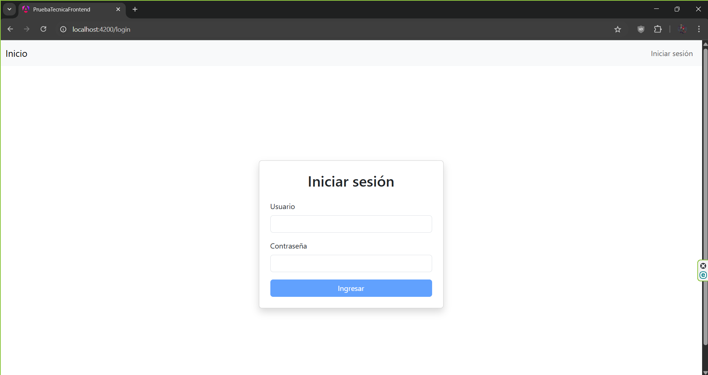
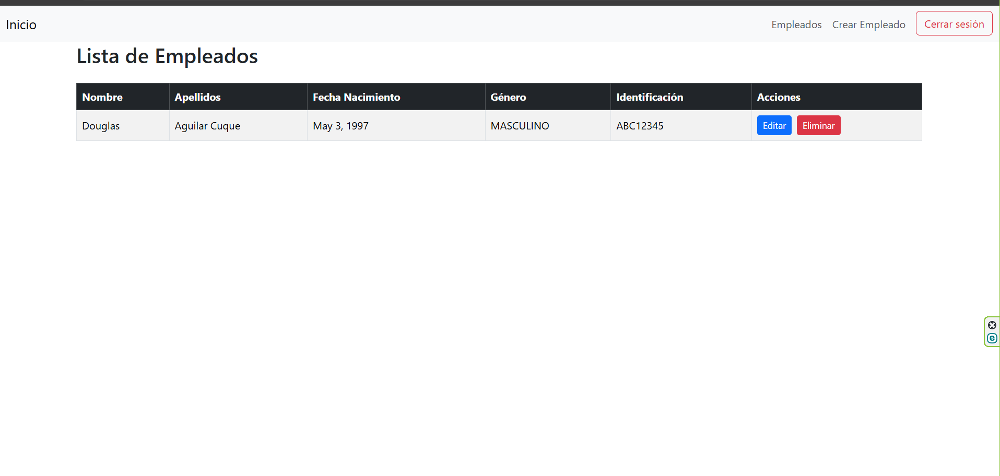
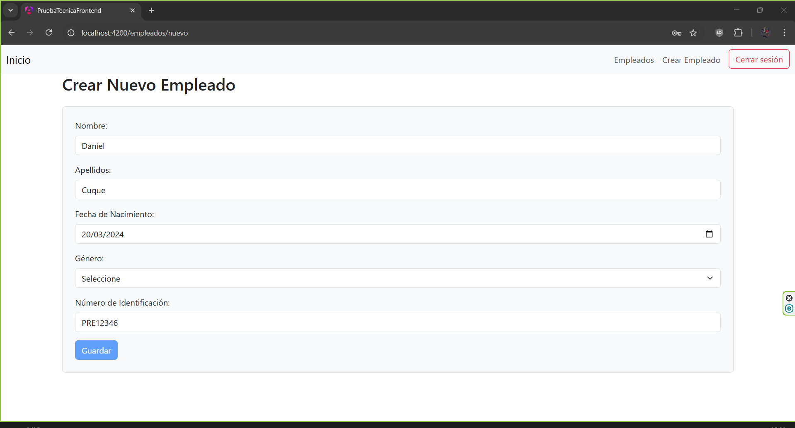
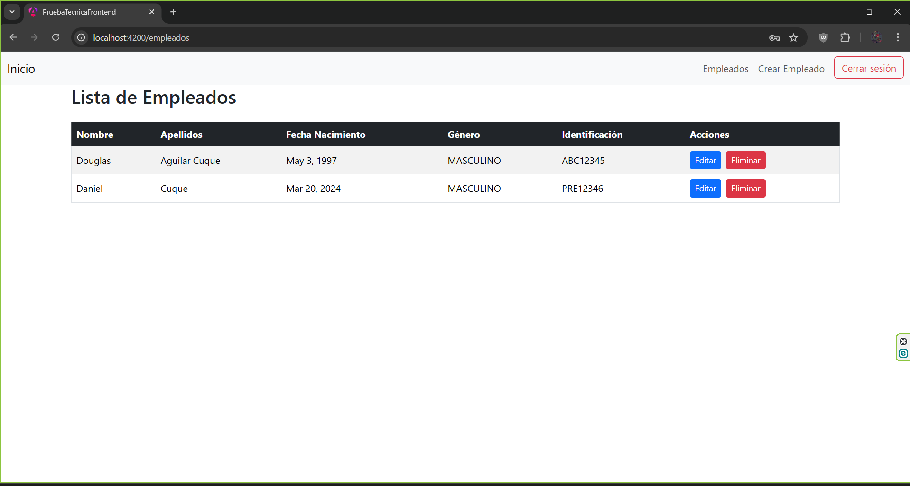
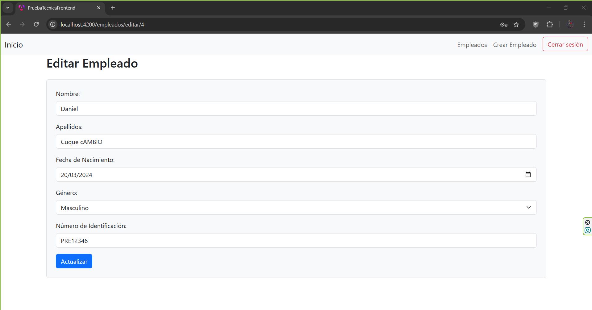
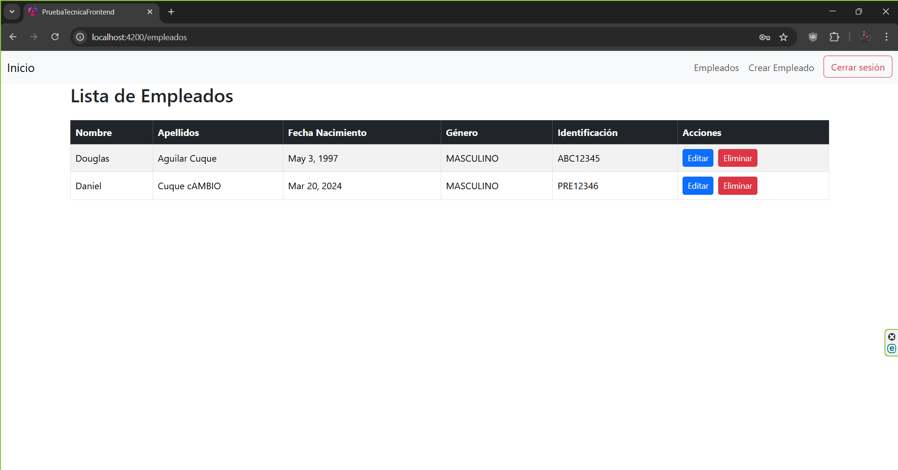
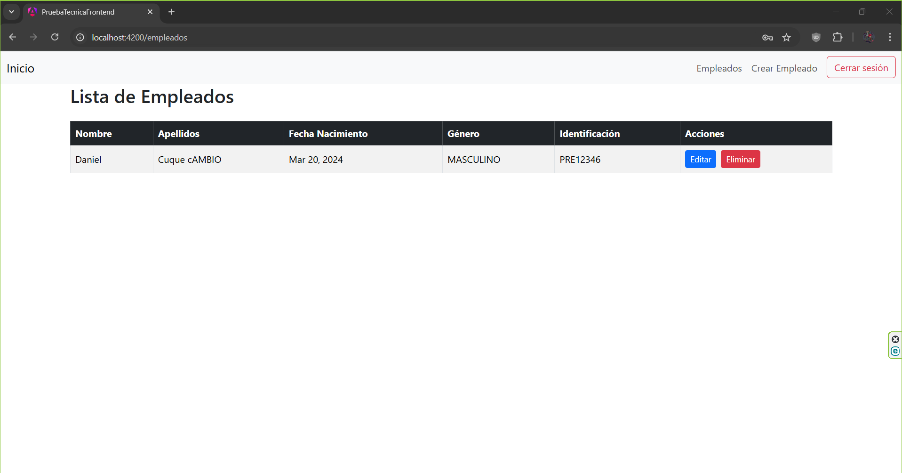

# Parte Teórica - Prueba Técnica

## 1. ¿Qué es un API REST y cómo se diferencia de SOAP?

API REST es una interfaz de programación de aplicaciones que sigue los principios de la arquitectura REST, mientras que SOA  es un patrón de arquitectura que organiza sistemas utilizando servicios independientes

rest usa el protoccolo HTTP Y SOPA USA HTTP, SMTO Y otrros.
REST usa JSON, XML, texto, etc. y SOAP sol XML


## 2. ¿Qué son y para qué son útiles los hilos? Dé un ejemplo.

Los HILOS permiten la ejecución concurrente de múltiples tareas dentro de un mismo proceso. Ejmmplo realizar operaciones en paralelo, como la lectura de archivos, procesamiento de datos o llamadas a servicios externos sin bloquear el flujo principal.


## 3. ¿Qué estructuras de datos se pueden utilizar para almacenar y manipular colecciones de elementos en Java?

Java proporciona varias estructuras de datos dentro del paquete `java.util`:

- **Listas**:
  - ArrayList
  - LinkedList

- **Conjuntos (Sets)**:
  - HashSet
  - TreeSet
  - LinkedHashSet

- **Mapas (Maps)**:
  - HashMap
  - TreeMap
  - LinkedHashMap

- **Colas y pilas**:
  - Queue
  - Deque
  - PriorityQueue
  - Stack


---

## 4. ¿Para manejo de base de datos qué herramienta se puede utilizar en Spring Boot?

En Spring Boot se pueden utilizar varias herramientas para interactuar con bases de datos:

- **Spring Data JPA**
- **Hibernate**
- **JDBC Template**
- **Flyway** o **Liquibase**:

---

## 5. ¿En qué se basa la autenticación por JWT y en qué se diferencia de la autenticación básica?

La autenticación JWT se basa en el uso de un token firmado digitalmente que contiene la información del usuario (como el username y roles). Este token se envía en cada solicitud HTTP para verificar al usuario sin necesidad de reautenticación.

Diferencias Token firmado, verificación segura, la basica Usuario y contraseña en cada solicitud (menos seguro)

---

## 6. De forma general, ¿Qué es y para qué sirven los pipelines en CI/CD?

Los pipelines en CI/CD son flujos automatizados que permiten compilar, testear y desplegar aplicaciones de manera rápida y segura.

Esto mejora la calidad del software, reduce errores humanos y acelera el ciclo de desarrollo.

---


# Instrucciones para correr los proyectos

1. Copiar el repositori:


```bash
  git clone https://github.com/DouglasAC/PruebaTecnicaMedi
```

## Para el Front-end

1. Entrar en la carpeta \Frontend\prueba-tecnica-frontend
2. Tener instalado nodejs y angular
3. Correr el comando npm install
4. Correr el comando ng serve

## Para el Back-end desde el IDE

1. Abrir el proyecto ubicado en Backend\PruebaTecnicaBackend
2. Instalar las dependencias 
3. Correr el proyecto

## Imagenes de funcionamiento

1. Pagina de inicio

2. Lista de empleados

3. Crear empleado


4. Editar empleado


5. Eliminar empleado
